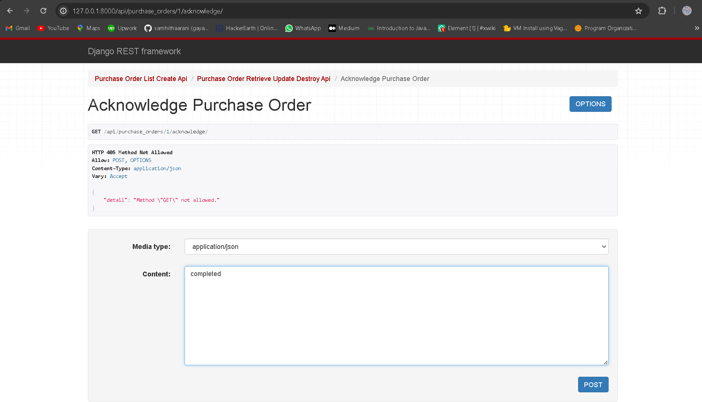

# Vendor Management System

The Vendor Management System is a Django-based application designed to manage vendor profiles, track purchase orders, and calculate vendor performance metrics.


## Installation

To run the Vendor Management System locally, follow these steps:

1. Clone the repository:

   https://github.com/samhithaarani/vendor_management_system/


2. Navigate to the project directory:


3. Install dependencies: using requirement.txt
```script
pip install -r requirements.txt

```

4. make migrations:
```script
python manage.py makemigrations
python manage.py migrate

```
5. Run the development server :
```script
python manage.py runserver

```


6. Access the application at `http://127.0.0.1:8000/api/vendors` in your web browser.

## Overview

The project consists of the following components:

- **Vendor Profile Management**: Allows users to create, retrieve, update, and delete vendor profiles.

- **Purchase Order Tracking**: Enables tracking of purchase orders, including creation, retrieval, update, and deletion functionalities.

- **Vendor Performance Evaluation**: Calculates vendor performance metrics such as on-time delivery rate, quality rating average, average response time, and fulfillment rate.

## Implemented Features

### Vendor Profile Management

- Created models, views, serializers, and API endpoints for managing vendor profiles.
- Implemented CRUD functionality for vendor profiles, including listing, creation, retrieval, update, and deletion.

### Screenshots for implemented API Endpoint

   ● POST /api/vendors/: Create a new vendor.
     
   ● GET /api/vendors/: List all vendors.
     
   ● GET /api/vendors/{vendor_id}/: Retrieve a specific vendor's details.
     
   ● PUT /api/vendors/{vendor_id}/: Update a vendor's details.
    DELETE /api/vendors/{vendor_id}/: Delete a vendor.
      


### Purchase Order Tracking

- Defined models, views, serializers, and API endpoints for tracking purchase orders.
- Implemented functionality to create, retrieve, update, and delete purchase orders.
- Validated datetime and JSON fields in purchase orders.

### Screenshots for implemented API Endpoint

   ● POST /api/vendors/: Create a new vendor.
     
   ● GET /api/vendors/: List all vendors.
     
   ● GET /api/vendors/{vendor_id}/: Retrieve a specific vendor's details.
   ● PUT /api/vendors/{vendor_id}/: Update a vendor's details.
    
    DELETE /api/vendors/{vendor_id}/: Delete a vendor.
      


● Vendor Performance Endpoint (GET /api/vendors/{vendor_id}/performance):
● Retrieves the calculated performance metrics for a specific vendor.
● Should return data including on_time_delivery_rate, quality_rating_avg,
average_response_time, and fulfillment_rate.


● Update Acknowledgment Endpoint:
● While not explicitly detailed in the previous sections, consider an endpoint like
POST /api/purchase_orders/{po_id}/acknowledge for vendors to acknowledge
POs.
● This endpoint will update acknowledgment_date and trigger the recalculation
of average_response_time.




